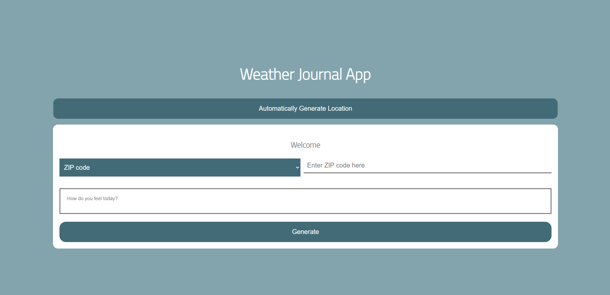

# Weather Application
Web Application based on Node JS used to view the temperature depending on the location that can be given in 3 ways: zip code, city name, or automatically detect your location
## Table of contents
- [Table of contents](#table-of-contents)
- [Demo-Preview](#demo-preview)
- [Description](#description)
- [Technologies](#technologies)
- [Footer](#footer)

## Demo-Preview
[(Back to top)](#table-of-contents)

## Description
[(Back to top)](#table-of-contents)
* The project is based on udacity course for web development
* Javascript used in the project to take inputs from a form and connect to the api to fetch the data needed

## Technologies
[(Back to top)](#table-of-contents)
#### Languages Used:
* JavaScript
* HTML and CSS styles
* Node JS

## Footer
[(Back to top)](#table-of-contents)
\
Done by Mohammed Yasser Mohammed Ahmed